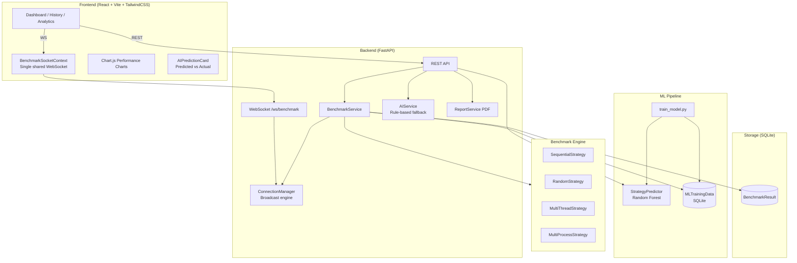

<div align="center">


# HashPilot

### AI-Powered Computational Benchmarking Platform

[](https://github.com/yourusername/HashPilot/actions)
[](https://python.org)
[](https://fastapi.tiangolo.com)
[](https://react.dev)
[](LICENSE)

HashPilot compares four hash-solving strategies in real time, predicts the optimal one with a Random Forest ML model, and delivers Grafana-style live telemetry with executive-grade PDF reports — all in a premium dark-mode SaaS UI.

[Live Demo](https://hashpilot.vercel.app) · [API Docs](http://localhost:8000/docs) · [Report Bug](https://github.com/yourusername/HashPilot/issues) · [Request Feature](https://github.com/yourusername/HashPilot/issues)

</div>

---

## ✨ Features

| Category | Feature |
|----------|---------|
| 🔬 **Benchmarking** | Sequential, Random, MultiThread, MultiProcess strategies |
| 🤖 **AI / ML** | Random Forest strategy predictor with confidence score |
| 📊 **Analytics** | Average hashrate charts, win-rate trends over time |
| 📡 **Live Telemetry** | Grafana-style WebSocket monitor (hash rate, nonce, attempts, elapsed) |
| 🧠 **Prediction vs Actual** | Compare AI prediction with the real benchmark winner |
| 🔄 **One-click Retrain** | Retrain the ML model from stored benchmark history |
| 📄 **PDF Reports** | Downloadable executive benchmark reports with AI recommendations |
| 📜 **History** | Searchable, filterable benchmark history with CSV export |
| 🌙 **Dark / Light theme** | System-aware with toggle |
| ⌨️ **Command Palette** | Ctrl+K quick navigation |
| 📱 **Responsive** | Mobile-first layout |
| 🐳 **Docker-ready** | Multi-stage Dockerfile + docker-compose |

---

## 🏗️ Architecture



---

## 🚀 Quick Start

### Prerequisites
- Python 3.13+
- Node.js 20+

### 1. Clone

```bash
git clone https://github.com/yourusername/HashPilot.git
cd HashPilot
```

### 2. Backend

```bash
cd backend
python -m venv .venv
source .venv/bin/activate          # Windows: .venv\Scripts\activate
pip install -r requirements.txt
cp .env.example .env               # edit if needed
uvicorn app.main:app --reload
```

API available at http://localhost:8000 · Docs at http://localhost:8000/docs

### 3. Frontend

```bash
cd frontend
cp .env.example .env               # set VITE_API_BASE_URL if backend is remote
npm install
npm run dev
```

UI available at http://localhost:5173

---

## 🐳 Docker

```bash
docker compose up --build
```

- Backend → http://localhost:8000
- Frontend → http://localhost:3000

---

## 📁 Folder Structure

```
HashPilot/
├── backend/
│   ├── app/
│   │   ├── api/           # FastAPI route handlers
│   │   ├── core/          # Config, logger, WebSocket manager
│   │   ├── engine/        # BenchmarkEngine + Proof-of-Work puzzle
│   │   ├── ml/            # Random Forest predictor + trainer
│   │   ├── models/        # SQLAlchemy ORM models
│   │   ├── repositories/  # Database access layer
│   │   ├── services/      # Business logic
│   │   └── strategies/    # Sequential, Random, MultiThread, MultiProcess
│   └── tests/             # pytest test suite
├── frontend/
│   └── src/
│       ├── api/           # Axios client
│       ├── components/    # Reusable UI components
│       ├── context/       # ThemeContext, BenchmarkSocketContext
│       ├── hooks/         # useBenchmarkSocket
│       ├── pages/         # Dashboard, History, Analytics, NotFound
│       └── config/        # Runtime URL configuration
├── docker-compose.yml
├── .github/workflows/ci.yml
└── README.md
```

---

## 🤖 AI / ML Pipeline

```
Run Benchmark → Save result to MLTrainingData (SQLite)
                         ↓
              POST /predict/retrain
                         ↓
          load_dataset() from DB → RandomForestClassifier
                         ↓
          strategy_model.pkl + label_encoder.pkl saved
                         ↓
          POST /predict/ → recommended_strategy + confidence + model_accuracy
```

**Features used:** `cpu_cores`, `logical_threads`, `ram_gb`, `difficulty`, `threads`, `processes`

**Target:** `winner_strategy` (the strategy with the highest hash rate)

---

## 🔌 API Reference

| Method | Endpoint | Description |
|--------|----------|-------------|
| `GET`  | `/`               | Health check |
| `GET`  | `/benchmark/`     | Run all four strategies |
| `GET`  | `/history/`       | Fetch benchmark history |
| `GET`  | `/analytics/`     | Aggregate statistics |
| `GET`  | `/system/`        | Hardware profile |
| `GET`  | `/report/`        | Generate + download PDF |
| `POST` | `/predict/`       | ML strategy prediction |
| `POST` | `/predict/retrain`| Retrain model from DB |
| `WS`   | `/ws/benchmark`   | Live telemetry stream |

Interactive docs: http://localhost:8000/docs

---

## 🧪 Testing

```bash
cd backend
# Fast tests (no benchmark execution):
pytest tests/ -v -m "not slow"

# All tests including full benchmark run:
pytest tests/ -v
```

---

## 🚢 Deployment

### Backend (Render / Railway)
1. Connect your GitHub repository.
2. Set build command: `pip install -r requirements.txt`
3. Set start command: `uvicorn app.main:app --host 0.0.0.0 --port $PORT`
4. Add environment variables from `.env.example`

### Frontend (Vercel)
1. Connect your repository and set root directory to `frontend`.
2. Set `VITE_API_BASE_URL` to your backend URL.
3. Deploy — Vercel auto-detects Vite.

---

## 🗺️ Roadmap

- [ ] PostgreSQL support for horizontal scaling
- [ ] JWT authentication + user sessions
- [ ] Real-time collaborative benchmarking
- [ ] Hardware profile comparison across devices
- [ ] Advanced ML: XGBoost / Neural Network predictor
- [ ] Slack / email notifications on benchmark completion
- [ ] Benchmark scheduling (cron-based)

---

## 🤝 Contributing

See [CONTRIBUTING.md](CONTRIBUTING.md) for guidelines, code style, and how to submit pull requests.

---

## 📄 License

This project is licensed under the MIT License — see [LICENSE](LICENSE) for details.

---

<div align="center">
  Built with ⚡ by HashPilot · <a href="https://github.com/yourusername/HashPilot">GitHub</a>
</div>
