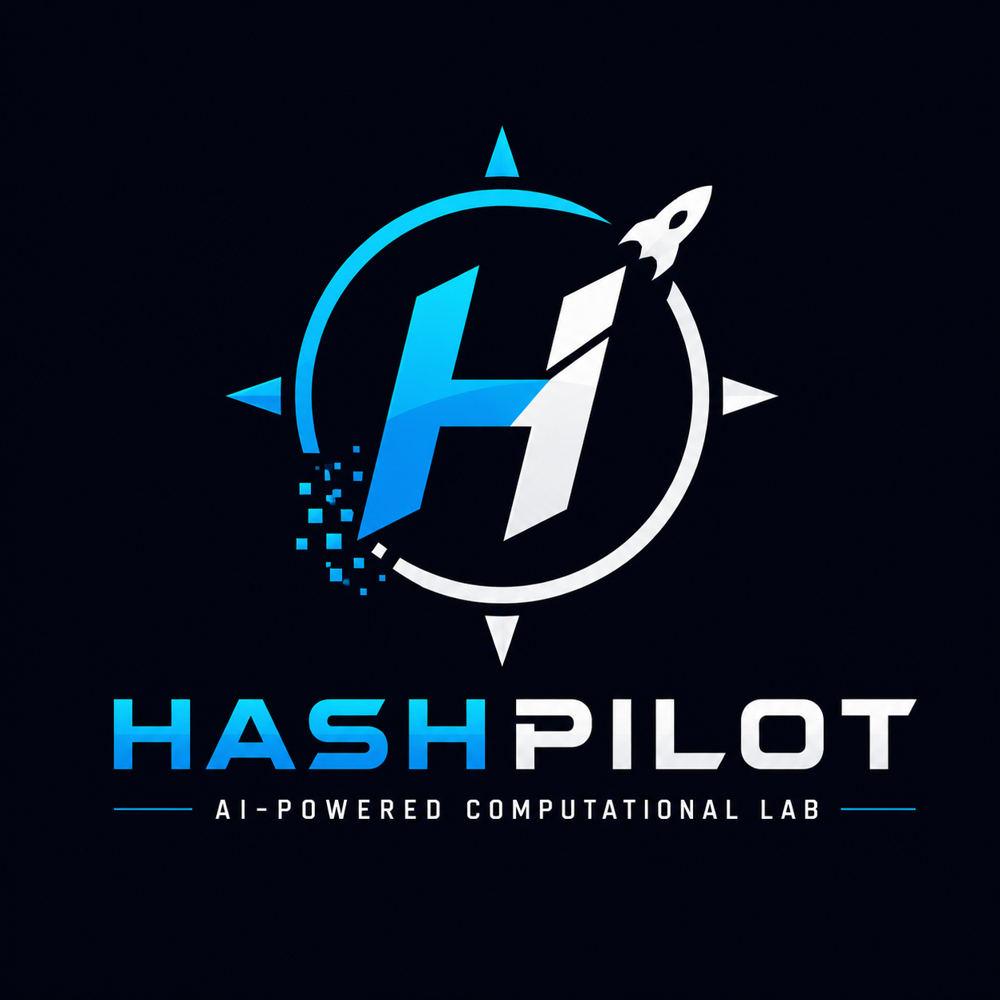

<p align="center">
  
</p>

<h1 align="center">HashPilot</h1>

<p align="center">
AI-Powered Computational Puzzle & Benchmarking Platform
</p>
# 🚀 HashPilot

> **An AI-Powered Computational Puzzle & Benchmarking Platform**

HashPilot is a modular research platform for solving and benchmarking computational puzzles using multiple search strategies. It provides a clean architecture for experimenting with Proof-of-Work puzzles, optimization algorithms, AI-based strategy selection, and performance analytics.

---

## Features

- ✅ Proof-of-Work Puzzle Engine
- ✅ Sequential Strategy
- ✅ Random Strategy
- ✅ MultiThread Strategy
- ✅ MultiProcess Strategy
- ✅ Benchmark Engine
- ✅ FastAPI REST API
- ✅ Interactive Swagger UI
- ✅ YAML Configuration
- ✅ JSON Benchmark Export
- ✅ Benchmark Chart Generation

---

## 🏗️ Architecture

```text
                  HashPilot

        +-----------------------+
        |      Dashboard        |
        +-----------------------+
                   |
             FastAPI Backend
                   |
     +-------------+-------------+
     |                           |
 Strategy Engine          Puzzle Engine
     |                           |
Sequential               Proof-of-Work
Random (Upcoming)        Custom Puzzles
AI (Upcoming)
     |
 Benchmark Engine
```

---

## 🛠️ Tech Stack

| Category | Technology |
|----------|------------|
| Language | Python 3.13 |
| Backend | FastAPI |
| AI | NumPy, Pandas |
| Version Control | Git & GitHub |
| Future Dashboard | React / Next.js |
| Containerization | Docker |

---

## 🚀 Getting Started

```bash
git clone https://github.com/RaghavendraPedada-1765/HashPilot.git

cd HashPilot/backend

python -m venv .venv

.\.venv\Scripts\activate

pip install -r requirements.txt

python -m app.main
```

---

## 📈 Current Status

### ✅ Version 0.1

- Core Puzzle Engine
- Proof-of-Work Puzzle
- Sequential Search Strategy
- Performance Metrics
- GitHub Repository

---

## 🗺️ Roadmap

### v0.2
- Random Strategy
- Benchmark Engine
- JSON Reports

### v0.3
- REST API
- CLI Improvements

### v0.4
- Interactive Dashboard

### v0.5
- AI Strategy Recommendation

### v1.0
- AI Computational Research Platform

---

## 📄 License

MIT License

---

## 👨‍💻 Author

**Raghavendra Pedada**

Building intelligent systems for computational research.
